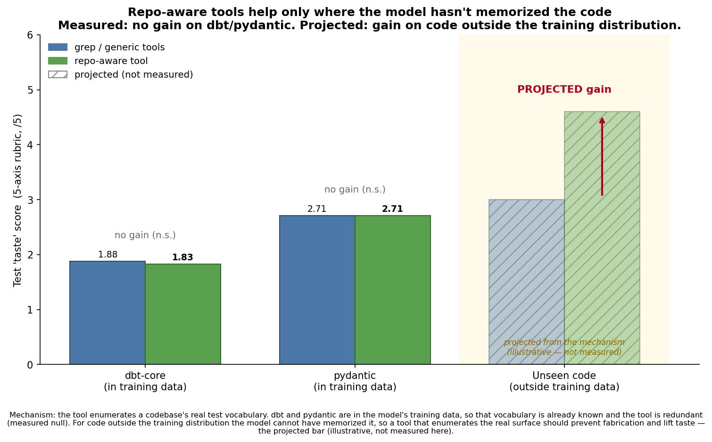

# Do repo-aware tools help a coding agent write tests?

**A controlled, contamination-aware study of semantic retrieval tools vs. generic
grep for agentic test generation.**

Stephen Chu · 2026

> **One-line result:** giving a coding agent custom, repo-aware retrieval tools
> did **not** beat the same agent with generic `grep`/`read`/`bash` on two
> well-known open-source repos — and there's a principled reason to expect that
> *specifically* on open-source code, which is the interesting part.

---

## The question

Coding agents write tests by exploring a repository. The common intuition is that
**custom, repo-aware tools** — semantic retrieval over a repo's own tests and
helpers — should beat an agent that just runs `grep`. This project tests that
intuition rigorously, holding everything fixed except the toolset.

**Arms (identical agent, task prompt, and budget; only the tools differ):**

| Arm | Tools | Role |
|-----|-------|------|
| **A1** | generic: `grep`, `read`, `bash` | strong Claude-Code-style baseline |
| **A3** | semantic: `find_related_tests`, `find_helpers` (+ `read`) | treatment |

**Why git history is the eval set.** For any real historical commit we already
know the test the maintainer actually wrote and merged. We hide that test,
regenerate it from the production diff with each arm, and score the result —
a free, labeled eval. Restricting to commits **after the model's training
cutoff** makes it contamination-aware.

Repos: **dbt-core** and **pydantic** (Python / pytest). Backend: Claude
(`claude-sonnet-4-6`), equal turn budget per arm.

---

## Headline finding: a clean null on custom retrieval tools

Across five different metrics, the semantic tools are **never the clear winner**.

| Metric | A1 (grep) | A3 (semantic) | Verdict |
|--------|-----------|---------------|---------|
| Style-mimicry alignment | baseline | mean Δ **−8.8** [−28.6, +5.3] | against A3 |
| Pairwise behavioral judge | 4/7 preferred | 2/7 preferred | against A3 |
| **Resolvability** (real symbols) | 77.6 | 86.8 [Δ −0.4, +26.3] | favors A3, **n.s.** |
| Indistinguishability (taste) | distinguish 0.375 | 0.667 | against A3 |
| Taste rubric (5-axis, /5) | 1.88 | 1.83 | tied |

A1 (grep) matches or beats A3 on style, preference, taste rubric, and
indistinguishability. A3's only edge — fewer hallucinated fixtures
(resolvability) — is **not statistically significant** and shrank by half once a
metric confound was fixed (below). This replicates across both repos and across
single-shot example-conditioning variants. **It is an honest negative result.**

---

## Why this is a *useful* null, not a boring one

The natural objection to a null is "your tools were weak." The more interesting
reading is a **boundary condition** that the design lets us state precisely:

> **Repo-aware retrieval tools fix what the model does not already know. Frontier
> models have effectively memorized large, popular open-source repos like dbt and
> pydantic — so the tools surface vocabulary the model already has, and add
> nothing. The value of such tooling should therefore grow as a codebase moves
> *out* of the training distribution.**

This is a falsifiable hypothesis with a concrete prediction:

- **On in-distribution code (public, popular):** tools ≈ grep. *(Directly observed
  here — two repos, multiple metrics, both retrieval and example-injection tools.)*
- **On out-of-distribution code (unseen / private / niche frameworks):** the gap
  should widen, because the model fabricates symbols it can't have memorized and a
  tool that *enumerates the real surface* does something grep structurally cannot —
  **you can't grep for a name you don't know exists.**



*The two open-source bars are **measured** in this study (no gain). The
unseen-code bar is **projected from the mechanism** — illustrative, not measured
here — and is exactly the regime the prediction targets.*

The practical implication for the field: **public benchmarks (SWE-bench and
friends) likely *understate* the value of repo-aware tooling, because the model
has already seen those repos.** A tool that looks useless on dbt may be exactly
what helps on a codebase the model has never encountered. Testing the
out-of-distribution half of this prediction rigorously (on code provably outside
training) is the natural follow-up.

---

## The methodological core (the real contribution)

The result matters less than how it was obtained. Three things make it credible:

### 1. Human-free "taste" evaluation
Rather than recruiting engineers to rate test *taste*, the repository's own
**merged** tests serve as revealed human acceptance (git history as the panel).
We measure **indistinguishability**: a blind judge tries to tell the generated
test from the real merged one. A low distinguish-rate = native taste. This both
scores nativeness and **self-validates the judge** (it must recover real merged
tests over generic ones) — with large n and full reproducibility, no human labels.

### 2. Most of the early "signal" was apparatus error — and was caught
The comparison only became trustworthy after fixing silent failures, each found
via **tool-call traces**:

- **The arms were secretly identical.** A permissive auto-approve setting let the
  treatment ignore its own MCP tools (0 tool calls) and behave exactly like the
  grep arm. Fixed with deny-by-default tool restrictions.
- **Tool leaks.** Unlisted tools and a spawned subagent escaped the restriction;
  fixed by blocking every known tool not explicitly allowed.
- **Budget too low → silent failures.** A turn cap made agents hit the limit
  before writing a test; raised with a wall-clock guard.

### 3. Confounds caught and corrected, not shipped
- **Whole-file ground truth biased style scoring.** Comparing a *focused*
  generated test to the maintainer's *entire* multi-test file penalized the
  treatment for omitting file-level imports it didn't need. Switched to precision.
- **Resolvability over-credited the treatment.** A naive fixture check treated the
  tool's own outputs as real by construction while flagging a valid external
  fixture as fake. De-biasing shrank the effect from **+17.5 (significant) to +9.2
  (not significant)** — the "win" was half artifact.

A separate result that **did** replicate and was then **retracted**: an early
example-conditioning taste gain (+0.28) on dbt did not hold on pydantic
(±0.2 swings at n≈12 are noise). It is reported as retracted rather than buried.

---

## What survives

- **Nativeness comes from agentic *exploration*, not example-injection.** The
  agentic grep arm produces far more maintainer-indistinguishable tests than any
  single-shot condition, even ones handed real repo examples. To look like the
  repo, the agent has to explore it.
- **Structural correctness saturates.** Whether a test references real symbols is
  a solvable ceiling that both arms hit — not where tools differentiate.
- **The bar for a useful coding-agent tool is higher than "surface relevant
  files."** Current frontier models are strong enough at grep-based exploration
  that, given the choice, they ignore custom retrieval tools — and when forced
  onto them, output does not clearly improve *on code they already know*.

## Limitations

Small paired n (7–9 commits); nothing reaches significance. Single language
(Python/pytest), k=1 sampling. Fixture/import realness is approximated
statically, not by executing tests. The design is *substitution* (semantic tools
*instead of* grep), a sharp contrast rather than the realistic augmentation case.

---

## Reproduce

```bash
python -m venv .venv && source .venv/bin/activate
pip install -e ".[dev]"
cp .env.example .env                       # add your ANTHROPIC_API_KEY

python scripts/extract_commits.py          # mine post-cutoff labeled commits
python scripts/build_graph.py              # test-to-code + co-modification graph
python scripts/run_experiment.py --exp-id run1 --arms A1 A3
python scripts/run_judge.py     --exp-id run1
python scripts/make_report.py   --exp-id run1
```

The target repo is a one-line change in `src/atw/config.py`. See `docs/` for
methodology, experiment design, the repo portfolio, prior art, and the taste
study.

## Layout

| Path | What |
|------|------|
| `src/atw/` | the package (ingest, graph, retrieval, mcp, agent, harness, metrics, eval) |
| `scripts/` | runnable CLIs (extract commits, build graph, run experiment, judge, report) |
| `docs/` | methodology, experiment design, repos, prior art, taste study |
| `reports/figures/` | result figures |
| `tests/` | tests for this codebase |

---

*Independent research. No proprietary code, data, or employer information is
included in this repository.*
