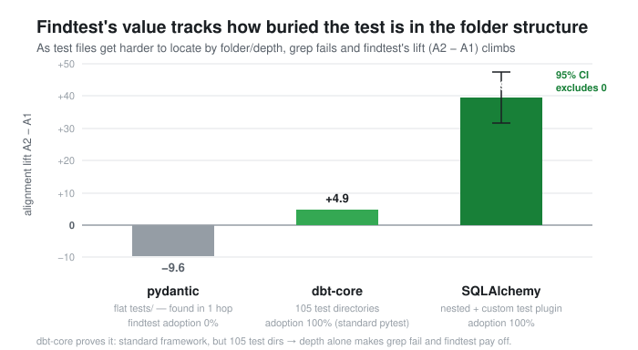
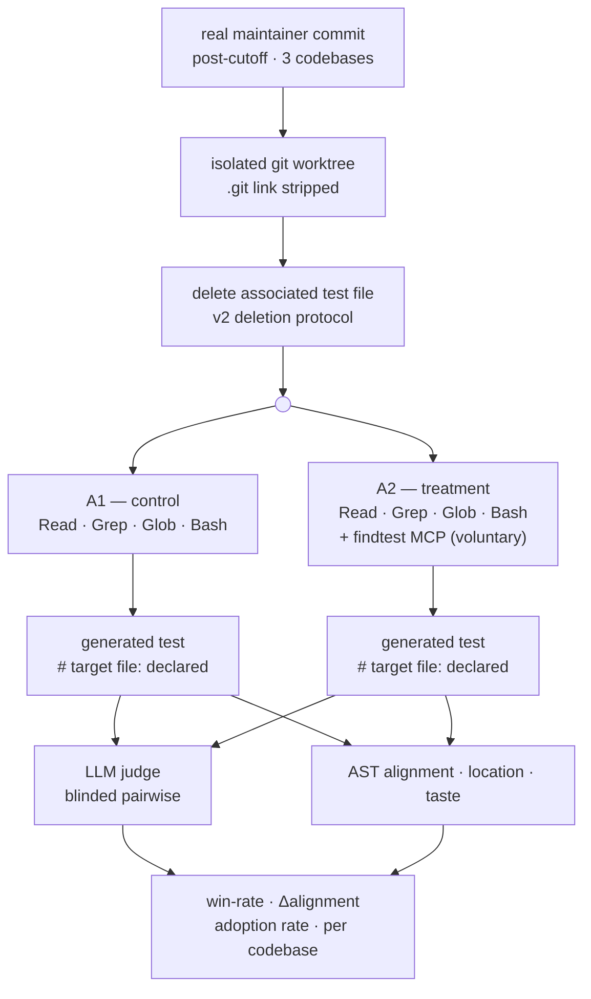

# agentic-test-eval

[](https://github.com/stephendchu/agentic-test-eval/actions/workflows/tests.yml)

> **🔎 Validate** · part 1 of a 3-part series on measuring & governing AI in regulated domains —
> **Validate (here)** · [📊 Measure](https://stephendchu.github.io/filing-event-eval/) · [🛡 Govern](https://stephendchu.github.io/assay/)

> **Can a semantic retrieval tool help an AI agent write better tests — and when does it matter?**

A controlled study of repository-aware test generation across three open-source Python codebases. Built to answer an honest question: does a custom tool that understands a repo's test history actually help, or does grep do the job just as well?

---

## The one-line finding

**Findtest adds value proportional to how much grep fails to navigate the test infrastructure.** On a codebase with a custom test framework, it produced a +39.7 alignment improvement with a confidence interval that excludes zero. On a codebase with standard conventions, grep was sufficient and findtest wasn't needed.



---

## Background: what findtest is

I built `findtest` — a semantic test retrieval MCP tool — for agentic coding at work. It maps source files to their associated tests using two signals: static import analysis and git co-modification history. When an AI agent is writing a new test, findtest answers:

- *Where do tests for this code live in this repo?*
- *What fixtures and helpers are in scope?*
- *What do the best existing tests for this module look like?*

At work it helped significantly. But internal results have a conflict-of-interest problem: I built the tool, I measured it, it worked. That's not evidence.

---

## The study

### v1: the null result (the interesting part)

I designed a rigorous open-source study. For each eval item: take a real git commit, hide the maintainer's test, have the agent regenerate it under two conditions — with and without findtest mounted — and score the output.

**v1 result on dbt-core (n=7): findtest lost.**

- Behavioral judge preferred grep 4/7, findtest 2/7
- Structural alignment: findtest −8.8 points behind grep

This was a negative result, not a failed experiment. The apparatus worked. The tool just didn't help.

### The diagnosis

Looking at the traces, I found the mechanism: **the old version of the target test file was still present in the worktree.** Grep found it in one hop. Both arms just copied its location, imports, and fixture style. The question findtest was built to answer — "where do tests for this code live?" — was already answered by the filesystem.

The internal study had produced strong positive results using a different protocol: the test file was *deleted* before the agent ran, making test-location and fixture discovery a real problem. That difference explained everything.

### v2: the deletion protocol

I redesigned the study around a single controlled change: **delete the associated test file from the worktree before each agent run.** Both arms get an identical deleted worktree. Three additional validity fixes were made to the harness (source leakage via the MCP server reading from HEAD rather than the worktree, git history accessible via worktree symlink, and production file misclassification in the deletion predicate).

Arms:
- **A1 (control):** `Read`, `Grep`, `Glob`, `Bash` — no findtest
- **A2 (treatment):** same tools + findtest MCP mounted, but not forced — voluntary adoption only

Voluntary adoption is itself a metric: if grep fails to find the deleted file, does the agent reach for findtest? That directly tests the mechanism.



### Three codebases

The study ran across three repos chosen to span a complexity gradient:

| Codebase | Test infrastructure | Grep difficulty (folder + depth) |
|----------|--------------------|----|
| **pydantic** | Standard pytest, flat `tests/` directory | Low |
| **dbt-core** | Standard pytest, 105 test directories, custom fixtures | Medium |
| **SQLAlchemy** | Custom `sqlalchemy.testing` plugin, `@testing.combinations`, `assert_compile` | High |

---

## Results

### The gradient

The mechanism is **test-file discoverability** — how hard the right test is to locate through the repo's folder structure and depth. As that rises, grep fails and findtest's lift grows: null on a flat layout, decisive on a deep/custom one. dbt-core is the proof that *depth alone* drives it — standard pytest, but 105 test directories was enough.

| Metric | pydantic | dbt-core | SQLAlchemy |
|--------|----------|----------|------------|
| MCP adoption (A2) | **0%** | **100%** | **100%** |
| Δ alignment A2 − A1 | −9.6 | +4.9 | **+39.7 ✓** |
| Judge win-rate (A2) | 0.000 | 0.556 | 0.667 |
| A1 correct location | 0/5 | 2/10 | **0/5** |
| A2 correct location | 0/5 | 4/10 | **4/5** |
| GT path surfaced (A2) | 1/5 | 7/10 | **4/5** |
| Taste: A2 distinguish-rate ↓ *(lower = more native)* | 0.75 | **0.900** | 1.0 |

*Alignment: structural AST match to ground truth (0–100). Judge: blinded pairwise LLM comparison. Location: did the agent declare the correct test file path. Taste/distinguish-rate: how often a blind judge correctly identified the AI-generated test (lower = more native-looking; 0.5 = indistinguishable from human).*

✓ *SQLAlchemy alignment CI [31.6, 47.5] excludes zero at n=5.*

### Reading the results

**pydantic — null, as expected.** The agent never called findtest (0% adoption). Pydantic's flat `tests/` directory with standard pytest means the agent can infer conventions from sibling files alone. Grep is sufficient. A1 marginally preferred by judge.

**dbt-core — findtest helps.** 100% voluntary adoption — every A2 run called findtest when grep couldn't find the deleted file. The agent found the correct test directory twice as often (4/10 vs 2/10). Judge split 5–4 in A2's favor. Taste nearly identical (0.909 vs 0.900), meaning findtest improved structure without making the output look more artificial.

**SQLAlchemy — findtest clearly wins.** A1 couldn't navigate SQLAlchemy's custom `sqlalchemy.testing` framework at all (0/5 correct location, avg alignment 15.6). A2 found the correct directory 4/5 times and produced tests with +39.7 higher structural alignment. Judge preferred A2 in 3 of 3 decided cases. The agent called findtest on every run (avg 1.75 calls), found the right test module, and completed tasks in fewer turns than A1 (47.8 vs 61.0).

### What findtest does and doesn't fix

Findtest is a **navigation tool**: it solves *where to look* and *what fixtures exist*. It doesn't close the stylistic gap — taste scores on SQLAlchemy were 1.0 for both arms, meaning the custom `@testing.combinations` and `assert_compile` patterns remained detectable as AI-generated regardless. That gap requires style guidance (CLAUDE.md, project skills, in-context examples) rather than retrieval. The two are complementary, not the same thing.

---

## The methodology contribution

The deletion protocol is the transferable finding. Any evaluation of a retrieval tool for agentic coding that leaves the target file present in the worktree will underestimate the tool's value — grep trivially wins a question already answered by the filesystem. The controlled deletion design:

1. Removes the information asymmetry that favors grep
2. Makes voluntary adoption measurable (does the agent reach for the tool when grep fails?)
3. Creates a fair test of the mechanism the tool was designed for

The three-codebase gradient — null on flat/standard, positive on complex/custom — gives a principled answer to *when* semantic retrieval matters, which is more useful than a single pass/fail result.

---

## Models & reproducibility

- **Model under test — `claude-sonnet-4-6`, held constant across both arms.** Run through the Claude Code agent (`claude -p`) with identical tools, turn budget, and prompt for A1 and A2. The model is the constant; the only variable is whether findtest is mounted.
- **Judge — `claude-sonnet-4-6`, same family as the generator.** Two guards against self-preference bias: pairwise comparisons are **blinded and order-randomized** (seeded), and — more importantly — the **headline metric is structural AST alignment, which is fully deterministic and model-independent.** The +39.7 result does not depend on the judge at all; the LLM judge win-rate is corroborating, not load-bearing.
- **Contamination control:** only commits **after 2026-02-01** are mined — past the model's (~Jan 2026) training cutoff — so the maintainer's real test was never in training data. (This is why naming the model matters: the cutoff control is only meaningful relative to a specific model.)
- **Honest caveats:** `sonnet-4-6` is a released alias, not a frozen dated snapshot; the LLM judge runs at the API's default sampling, not temperature 0 — mitigated by seeded blinding and k=3 rollouts per commit for variance. An independent judge from a different model family is the obvious next hardening step.

---

## Repository layout

| Path | What |
|------|------|
| `src/atw/retrieval/test_finder.py` | Findtest algorithm: import graph + co-modification history + quality scoring |
| `src/atw/mcp/server.py` | MCP server exposing findtest as `find_related_tests` + `find_helpers` |
| `src/atw/harness/sandbox.py` | Worktree setup with v2 deletion protocol and git-strip |
| `src/atw/metrics/` | Alignment (AST), behavioral judge, conformity/taste, location discovery |
| `src/atw/graph/` | Repo knowledge graph: import edges + co-modification pairs + quality scoring |
| `scripts/run_experiment.py` | Run A1 vs A2 over a commit slice (resumable, rate-limit safe) |
| `scripts/analyze_v2.py` | Statistical analysis: alignment CI, judge win-rate, adoption, location |
| `scripts/run_conformity.py` | Taste/indistinguishability eval |
| `docs/methodology.md` | Full experiment design, controls, metrics, disclosed decisions |
| `docs/roadmap.md` | Full results history: v1 null, apparatus bugs found and fixed, v2 findings |
| `docs/v2-runbook.md` | Self-contained guide to reproduce the study |
| `tests/` | Unit tests for harness, retrieval, metrics |

## Quickstart

```bash
python -m venv .venv && source .venv/bin/activate
pip install -e ".[dev]"
cp .env.example .env   # add ANTHROPIC_API_KEY for judge/conformity scoring

# Run the study on dbt-core (~$20 API credit, ~8h serial)
ATW_REPO=dbt-core .venv/bin/python scripts/run_experiment.py \
  --protocol v2 --n 25 --exp-id v2-dbt-core --arms A1 A2

# Score and analyze
ATW_REPO=dbt-core .venv/bin/python scripts/run_judge.py --exp-id v2-dbt-core --arm-a A1 --arm-b A2
ATW_REPO=dbt-core .venv/bin/python scripts/score_location.py --exp-id v2-dbt-core
ATW_REPO=dbt-core .venv/bin/python scripts/run_conformity.py --exp-id v2-dbt-core --arms A1 A2
.venv/bin/python scripts/analyze_v2.py --exp-ids v2-dbt-core v2-pydantic v2-sqlalchemy
```

See `docs/v2-runbook.md` for the complete reproduction guide.

## Prior art

Existing benchmarks (TestGenEval, SWT-Bench, TestExplora) evaluate *models* on test generation. This study evaluates a *retrieval tool*: does semantic test-mapping scaffolding change agentic outcomes when holding the model constant? The deletion-protocol design and voluntary-adoption metric are not present in published benchmarks as of June 2026.

> **Honest measurement is the brand.** Every repo in this three-part series reports its own null or limitation, not a vanity number — here, v1 was a clean negative result (findtest lost when grep could already find the test), and findtest is null on flat/standard codebases by design.
